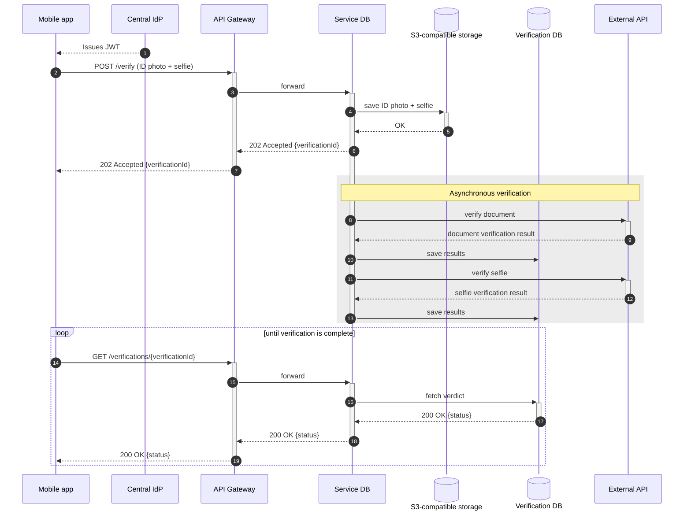

# Identity verification (KYC): sequence diagram

```mermaid
sequenceDiagram
    autonumber
    participant App as Mobile app
    participant IdP as Central IdP
    participant GW as API Gateway
    participant VS as Service DB
    participant S3@{ "type": "database", "alias": "S3-compatible storage" }
    participant DB@{ "type": "database", "alias": "Verification DB" }
    participant API as External API

    IdP-->>App: Issues JWT

    App->>+GW: POST /verify (ID photo + selfie)
    GW->>+VS: forward
    VS->>+S3: save ID photo + selfie
    S3-->>-VS: OK
    VS-->>GW: 202 Accepted {verificationId}
    GW-->>-App: 202 Accepted {verificationId}

    rect rgba(128, 128, 128, 0.15)
        Note over VS,API: Asynchronous verification
        VS->>+API: verify document
        API-->>-VS: document verification result
        VS->>DB: save results
        VS->>+API: verify selfie
        API-->>-VS: selfie verification result
        VS->>DB: save results
    end
    deactivate VS

    loop until verification is complete
        App->>+GW: GET /verifications/{verificationId}
        GW->>+VS: forward
        VS->>+DB: fetch verdict
        DB-->>-VS: 200 OK {status}
        VS-->>-GW: 200 OK {status}
        GW-->>-App: 200 OK {status}
    end
```
